# Введение в R
odintsovajulia19@yandex.ru

## Цель работы

1.  Развить практические навыки использования языка программирования R
    для обработки данных

2.  Развить навыки работы в Rstudio IDE:

-   установка пакетов
-   работа с проектами в Rstudio
-   настройка и работа с Git

1.  Закрепить знания базовых типов данных языка R и простейших операций
    с ними

## Исходные данные

1.  Программное обеспечение Windows 10.
2.  RStudio Desktop
3.  Интерпретатор языка R 4.1.
4.  Программный пакет swirl.

## Задание

Используя программный пакет swirl, освоить базовые операции в языке
программирования R.

## Ход работы

### Задание 1: Установка swirl

Для развертывания swirl на RStudio необходимо выполнить следующие шаги:

``` r
#install.packages("swirl")
#swirl::swirl()
```

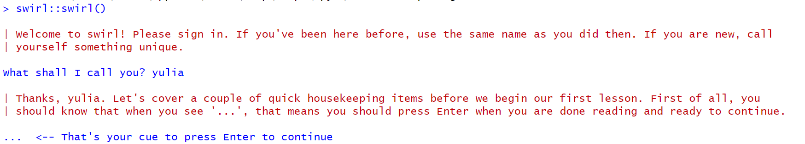

### Задание 2: Курс R Programming: The basics of programming in R

-   Выбран курс “R Programming: The basics of programming in R”

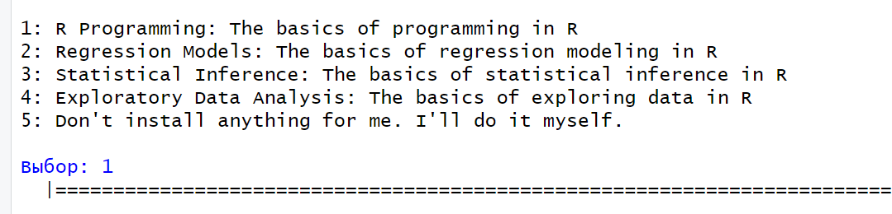

-   Были выполенены следующие модули курса:

#### Базовые структурные блоки (Basic Building Blocks)

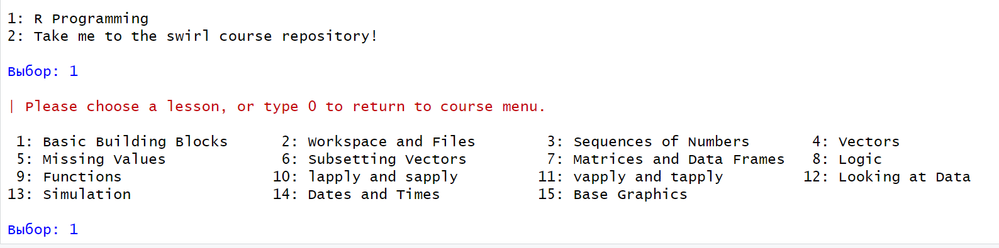 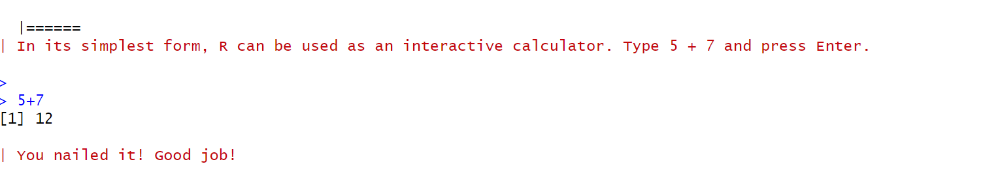 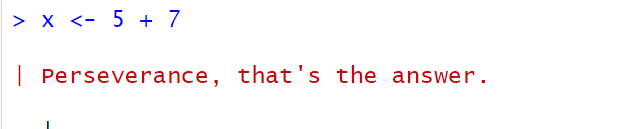 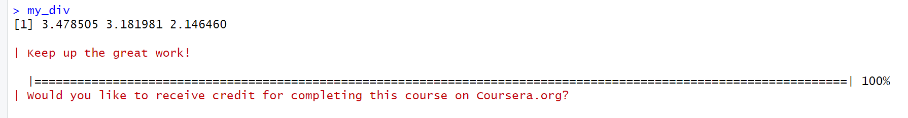
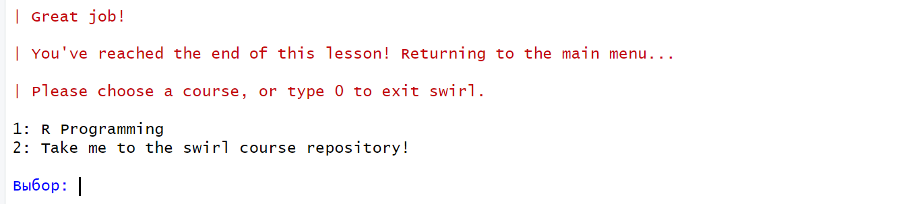

#### Рабочие пространства и файлы (Workspace and Files)

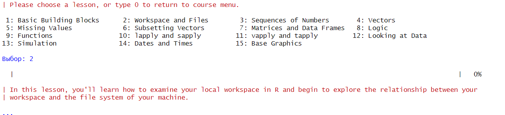 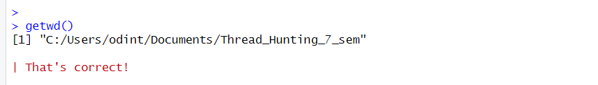 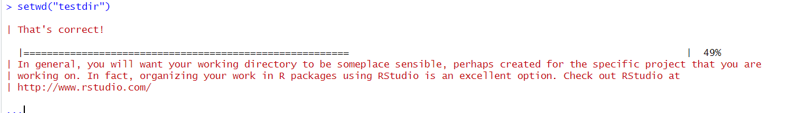 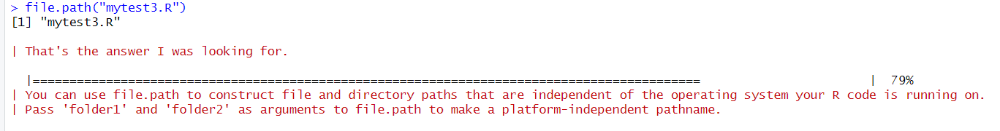
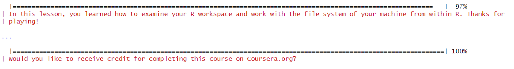

#### Последовательности чисел (Sequences of Numbers)

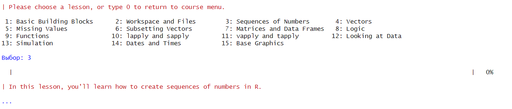 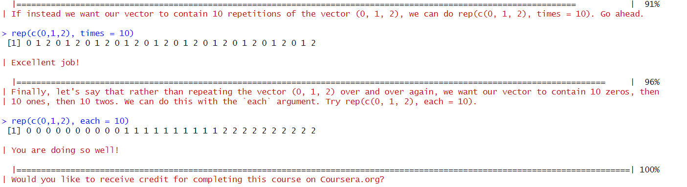

#### Векторы (Vectors)

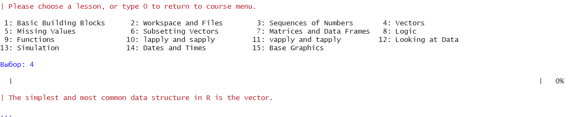 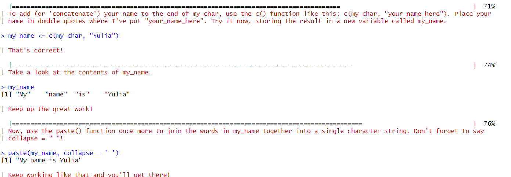 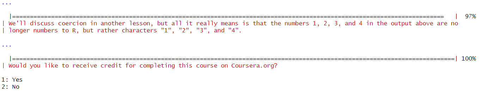

#### Пропущенные значения (Missing Values)

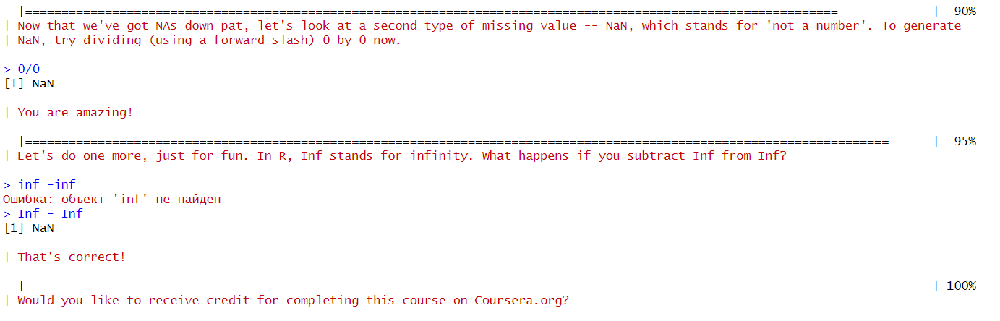

## Оценка результата

Были пройдены необходимые модули курса “R Programming: The basics of
programming in R”.

## Вывод

Были развиты практические навыки использования языка программирования R
для обработки данных и закреплены знания базовых типов данных языка R и
простейших операций с ними.
