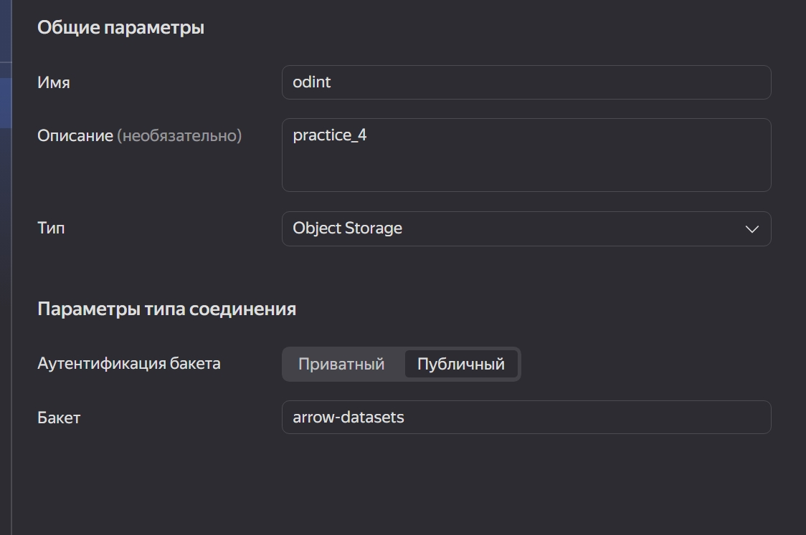
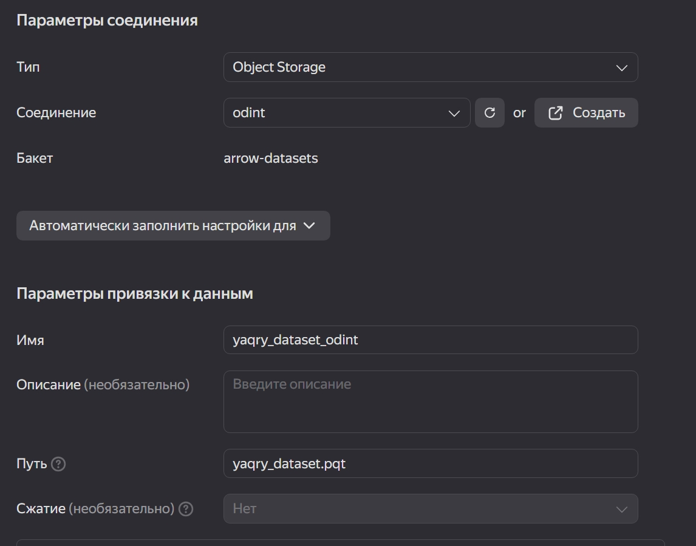
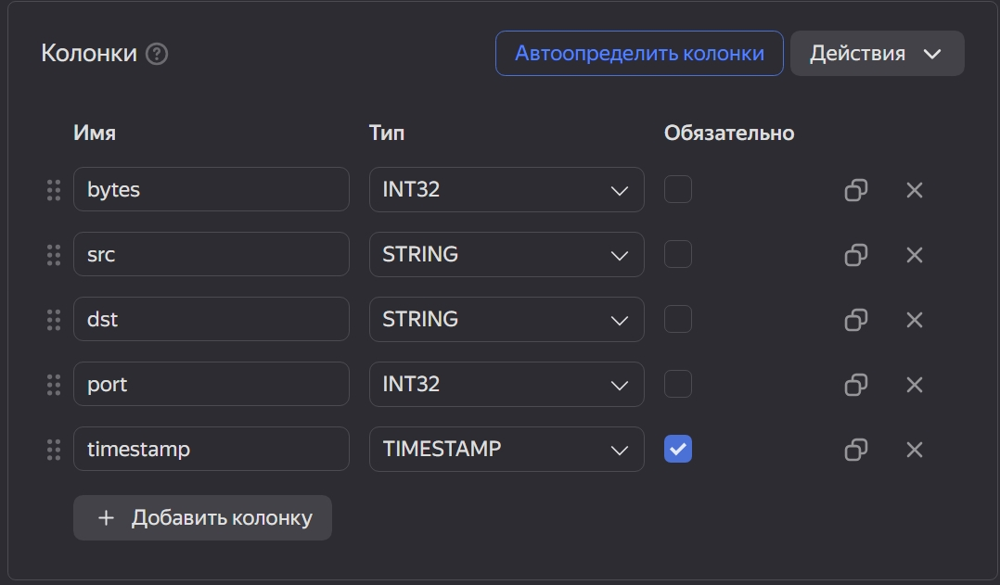
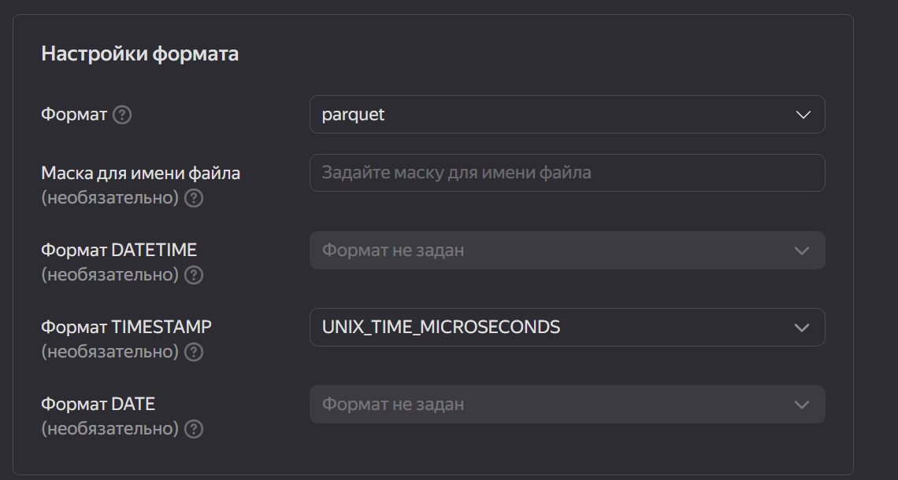
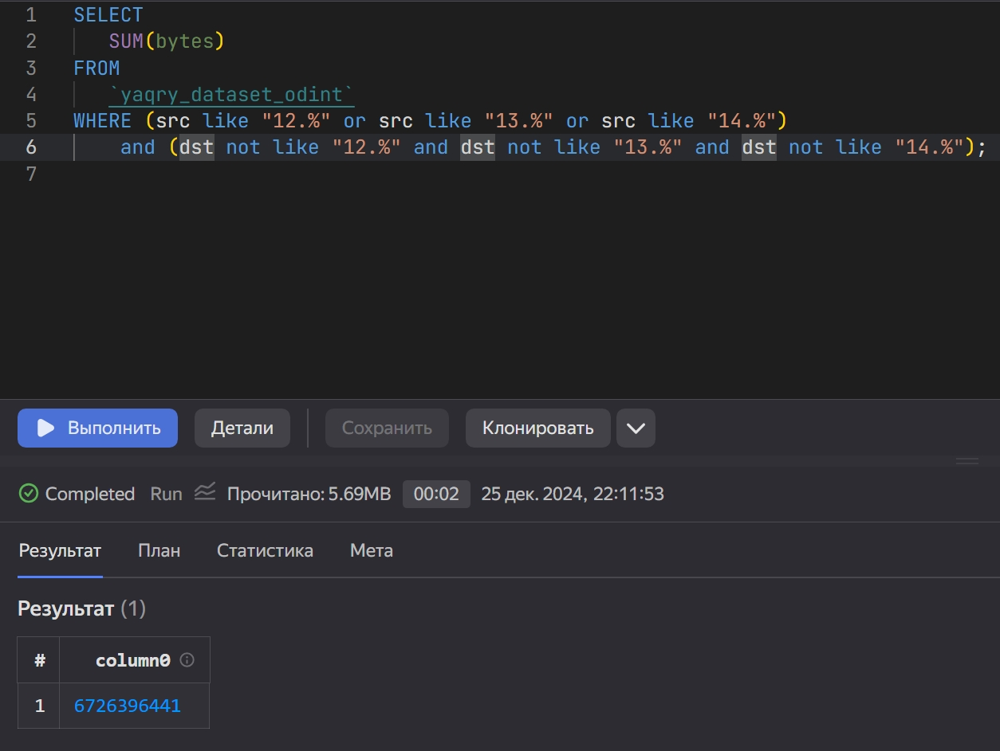

# Использование технологии Yandex Query для анализа данных сетевой
активности
odintsovajulia19@yandex.ru

## Цель работы

1.  Изучить возможности технологии Yandex Query для анализа
    структурированных наборов данных
2.  Получить навыки построения аналитического пайплайна для анализа
    данных с помощью сервисов Yandex Cloud
3.  Закрепить практические навыки использования SQL для анализа данных
    сетевой активности в сегментированной корпоративной сети

## Исходные данные

1.  Программное обеспечение Windows 10
2.  Yandex Object Storage.
3.  yaqry_dataset.pqt
4.  Yandex Query

## Задание

Используя сервис Yandex Query настроить доступ к данным, хранящимся в
сервисе хранения данных Yandex Object Storage. При помощи
соответствующих SQL запросов ответить на вопросы.

## Ход работы

### Подготовка рабочей среды

-   Проверим доступ к бакету:
    https://storage.yandexcloud.net/arrow-datasets


-   Создаем свое соединение к общему облаку mirea-ddslab-cloud:





-   Задаем настройки формата согласно схеме:

``` r
#SCHEMA=(
# timestamp TIMESTAMP NOT NULL,
# src STRING,
# dst STRING,
# port INT32,
# bytes INT32
# )
```





-   Проверяем подключение


## Задания

### Задание 1. Известно, что IP адреса внутренней сети начинаются с октетов, принадлежащих интервалу \[12-14\]. Определите количество хостов внутренней сети, представленных в датасете.

-   Считаем адреса src по маске “12.%” … “14.%”.


### Задание 2. Определите суммарный объем исходящего трафика.

-   Ищем трафик, где src принадлежит внутренней сети, а dst нет.



### Задание 3. Определите суммарный объем входящего трафика.

-   Ищем трафик, где dst принадлежит внутренней сети, а src нет.


## Оценка результата

С использованием инструментов YandexQuery были проделаны задания по
основам обработки данных.

## Вывод

Ознакомились с YandexQuery, повторили технологии анализа данных.
